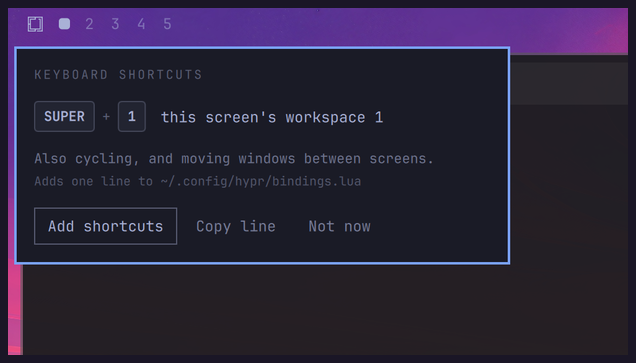

# Per-monitor Workspaces for Omarchy

Give every screen its own set of workspaces. `SUPER+3` always means *this
screen's third workspace* — never "jump to whichever monitor happens to own
workspace 3".


## Why

Omarchy binds `SUPER+1..0` to ten global workspaces shared by every monitor. On
a laptop alone that is fine. Plug in a second screen and it grates: you press
`SUPER+1` on your big screen and focus jumps to the laptop, because that is
where workspace 1 happens to live. The screen you were looking at does nothing.

With this plugin each monitor gets its own set, the way dwm, awesome and i3 do
it. Nothing is hardcoded — no monitor names, no workspace rules. A screen gets
its own set the first time you press a slot key on it.

## How it works, honestly

**Hyprland has no per-monitor workspaces.** Its workspaces are global: one flat
list, any of which can be shown on any monitor. There is no lower level to
configure — a native version of this would have to come from Hyprland itself.

So this plugin builds the idea on top of what Hyprland does offer: *named*
workspaces. Each screen gets workspaces named after it — `<screen>:1`,
`<screen>:2` — and `SUPER+1` resolves to a name at the moment you press it,
from whichever screen has focus. You never see those names; the bar labels
everything by position.

That is the whole trick, and it explains the edges: a workspace still belongs to
Hyprland's one global list, so unplugging a screen leaves its workspaces parked
on a surviving one, and a returning screen has to be put back on its own. Both
are handled — see [Unplugging a screen](#unplugging-a-screen).

## Requirements

- Omarchy 4 (Quattro), using the built-in bar
- Hyprland with the Lua config

## Install

```sh
omarchy plugin add https://github.com/mmsbrggr/omarchy-per-monitor-workspaces.git --enable
```

That is the whole feature: per-monitor workspaces, the bar indicators, and the
screen handling when you dock. It takes the built-in workspace widget's place in
your bar, and hands it back if you ever remove the plugin.

### Keyboard shortcuts

Optional, and strongly recommended — without them `SUPER+N` keeps switching
Omarchy's global workspaces, which is not what the dots show. The first time the
widget runs without them, it offers:



**Add shortcuts** appends one line to `~/.config/hypr/bindings.lua`, **Copy
line** hands it to you to place yourself, **Not now** declines and is not asked
again. Nothing is written until you choose, the write only appends, and your
previous file is kept as `bindings.lua.bak`.

By hand, that line is:

```lua
pcall(dofile, os.getenv("HOME") .. "/.config/omarchy/plugins/mmsbrggr.per-monitor-workspaces/hypr/init.lua")
```

> Omarchy's plugin installer never runs code from a plugin — it only clones
> files — so a plugin cannot add keybindings to your config on its own.

## Keys

### On one screen

| Key | Does |
| --- | --- |
| `SUPER + 1..5` | Focus this screen's workspace 1..5 |
| `SUPER + SHIFT + 1..5` | Move the window there and follow it |
| `SUPER + SHIFT + ALT + 1..5` | Move the window there, stay where you are |
| `SUPER + TAB` / `SUPER + SHIFT + TAB` | Next / previous workspace on this screen |
| `SUPER + scroll` | Same, with the wheel |
| `SUPER + CTRL + TAB` | Back to this screen's previous workspace |

Cycling walks the slots in order whether or not you have used one yet — Hyprland
deletes a workspace as soon as its last window closes, so a cycle over only the
live ones would usually be a cycle of one.

### Across screens

| Key | Does |
| --- | --- |
| `SUPER + CTRL + ALT + ←↑↓→` | Focus the screen in that direction |
| `SUPER + CTRL + SHIFT + ←↑↓→` | Send the window there and follow |
| `SUPER + SHIFT + ALT + ←↑↓→` | Send everything on this workspace there |
| `SUPER + CTRL + ALT + SHIFT + ←↑↓→` | Swap this screen's windows with that screen's |

Directions are physical, so there are no monitor numbers to memorise. These move
**windows, not workspaces** — every workspace stays on the screen it belongs to,
and focus follows what you sent. Swapping keeps both screens' tiling intact.

### With the mouse

On the dots: **left-click** to focus, **right-click** to send the focused window
there, **scroll** to cycle. Each bar acts on its own screen.

### What this changes in Omarchy's defaults

`SUPER + 6..0` are removed — with per-monitor slots they could only pull you to
another screen. `SUPER + CTRL + TAB` and `SUPER + SHIFT + ALT + ←↑↓→` are
rebound for the same reason. Everything else is untouched.

## Configuration

Five slots per screen by default:

```sh
omarchy bar set mmsbrggr.per-monitor-workspaces count 8 --json
```

That is an ordinary widget setting on your `shell.json` entry, which is where
Omarchy keeps plugin settings — you can edit it there directly too. The widget
projects it into `~/.local/state/omarchy/` for the shortcuts to read, and hands
the running Hyprland the same number, so the keys change along with the dots
rather than at the next reload.

### Your own keybindings

The shortcuts are one opinionated arrangement; the actions underneath are the
part that matters. Load `hypr/actions.lua` instead of `hypr/init.lua` and bind
whatever you like:

```lua
local pmw = dofile(os.getenv("HOME") ..
  "/.config/omarchy/plugins/mmsbrggr.per-monitor-workspaces/hypr/actions.lua")

o.bind("SUPER + code:10", "Workspace 1",  pmw.focus_slot(1))
o.bind("SUPER + TAB",     "Next",         pmw.cycle(1))
o.bind("SUPER + ALT + L", "Screen right", pmw.focus_monitor("r"))
```

`focus_slot`, `move_to_slot`, `move_to_slot_silently`, `cycle`, `focus_monitor`,
`send_window`, `send_workspace`, `swap_workspaces`, plus `count`. Each takes its
argument and returns a function to bind.

`count` changes while Hyprland runs, whenever you change the setting. Keys that
depend on how many slots there are go inside `on_count`, which runs immediately
and again on every change. A shrink arrives the same way as a growth, so drop
the keys before binding the current set — unbinding a key that is not bound
costs nothing:

```lua
pmw.on_count(function(count)
  for slot = 1, 10 do hl.unbind("SUPER + code:" .. (slot + 9)) end

  for slot = 1, math.min(count, 10) do
    o.bind("SUPER + code:" .. (slot + 9), "Workspace " .. slot, pmw.focus_slot(slot))
  end
end)
```

## Unplugging a screen

Hyprland parks a disconnected screen's workspaces on a surviving one. The bar
shows them after your numbered slots, as a display glyph rather than a number —
the number they carry belongs to the screen they came from, and printing it
would put a second "4" after this screen's "5". Hover to see where it came from,
and `SUPER + TAB` reaches them, so nothing is stranded.


Plug the screen back in and its workspaces come home with their windows. Left to
itself Hyprland hands a returning screen a fresh global workspace, and a dock can
put the same panel on a different connector than last time, which leaves two
screens showing each other's workspaces. The widget sorts both out.

Screens are identified by description rather than connector, because `DP-2` and
`DP-3` can swap on replug. Two identical panels that report no serial describe
themselves alike; those get the connector appended to tell them apart.

## Uninstall

```sh
omarchy plugin remove mmsbrggr.per-monitor-workspaces
```

Omarchy's built-in workspace widget goes back where this one was. Then remove the
`pcall(dofile, ...)` line from `~/.config/hypr/bindings.lua`.

## License

MIT. The bar widget is derived from Omarchy's built-in workspace widget.
