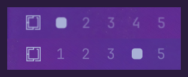

# Per-monitor Workspaces for Omarchy

Give every screen its own set of workspaces. `SUPER+3` always means *this
screen's third workspace* — never "jump to whichever monitor happens to own
workspace 3".



If you have used dwm, awesome, or i3 with per-output workspaces, this is that,
for Omarchy.

## Why

Omarchy binds `SUPER+1..0` to ten global workspaces shared by every monitor. On
a laptop alone that is fine. Plug in a second screen and it starts to grate:

- You are working on your big screen, press `SUPER+1`, and focus silently jumps
  to the laptop — because that is where workspace 1 happens to live.
- The screen you were looking at appears to do nothing at all.
- You end up mentally tracking which numbers "belong" to which display.

With this plugin each monitor gets its own independent set. `SUPER+1` on your
external screen goes to *that screen's* first workspace, and the laptop stays
exactly where it was.

Nothing is hardcoded — no monitor names, no workspace rules, no ids in your
config. A monitor gets its own set the first time you press a slot key on it,
whether you run one screen or five, docked or not, including screens the config
has never seen before.

## Requirements

- Omarchy 4 (Quattro), using the built-in bar
- Hyprland with the Lua config (developed against 0.56.2)

## Install

It comes in two halves — a bar widget and a set of keybindings. You want both.

**1. The widget**

```sh
omarchy plugin add https://github.com/mmsbrggr/omarchy-per-monitor-workspaces.git --enable
```

It drops into the exact bar position Omarchy's built-in workspace widget was
using, and hands that spot back if you ever disable it.

**2. The keybindings**

Append one line to `~/.config/hypr/bindings.lua`:

```lua
pcall(dofile, os.getenv("HOME") .. "/.config/omarchy/plugins/io.github.mmsbrggr.per-monitor-workspaces/hypr/init.lua")
```

Save, and Hyprland reloads on its own. That's it.

> **Why the manual step?** Omarchy's plugin installer deliberately never runs
> code from a plugin — it only clones files — so the keybinding half cannot
> install itself. Better that than an installer that executes whatever it just
> downloaded.

If you skip step 2, the widget tells you rather than leaving you guessing:


Hover it for the fix. Until the bindings are loaded the bar draws per-monitor
slots while `SUPER+N` still switches global workspaces — which looks like a
broken widget if nothing points it out.

<details>
<summary>Why <code>pcall</code> and <code>dofile</code>?</summary>

`dofile` rather than `require`, because plugin directories are named
`<author>.<name>` and the dot breaks Lua's module paths. Wrapped in `pcall` so
that removing the plugin later costs you the per-monitor bindings rather than
everything after that line in your config.
</details>

## Keys

### On one screen

| Key | Does |
| --- | --- |
| `SUPER + 1..5` | Focus this screen's workspace 1..5 |
| `SUPER + SHIFT + 1..5` | Move the window there and follow it |
| `SUPER + SHIFT + ALT + 1..5` | Move the window there, stay where you are |
| `SUPER + TAB` / `SUPER + SHIFT + TAB` | Next / previous workspace on this screen |
| `SUPER + scroll` | Same, with the wheel |
| `SUPER + CTRL + TAB` | Back to this screen's previous workspace |

Cycling walks the slots in order, `1 → 2 → … → 5 → 1`, whether or not you have
used a slot yet. Hyprland deletes a workspace the moment its last window closes,
so a cycle over only the live ones would usually be a cycle of one.

### Across screens

| Key | Does |
| --- | --- |
| `SUPER + CTRL + ALT + ←↑↓→` | Focus the screen in that direction |
| `SUPER + CTRL + SHIFT + ←↑↓→` | Send the window to that screen and follow |
| `SUPER + SHIFT + ALT + ←↑↓→` | Send everything on this workspace to that screen |
| `SUPER + CTRL + ALT + SHIFT + ←↑↓→` | Swap this screen's windows with that screen's |

Directions are physical — you already know which screen is on your left — so
there are no monitor numbers to memorise and none cluttering the bar.

These move **windows, not workspaces**: every workspace stays on the screen it
belongs to, and what travels is what is on it. Windows land on whatever the
target screen is currently showing.

### With the mouse

On the workspace dots: **left-click** to focus, **right-click** to send the
focused window there without following it, **scroll** to cycle. Each bar acts on
its own screen, so scrolling the second monitor's bar moves that screen rather
than the one you happen to be focused on.

### What this changes in your Omarchy defaults

`SUPER + 6..0` are removed — with per-monitor slots they could only ever pull
you to another screen. `SUPER + CTRL + TAB` and `SUPER + SHIFT + ALT + ←↑↓→` are
rebound for the same reason: stock, both can drag you to a different display.

Everything else is untouched — the scratchpad, window tiling and resizing, the
bar panels on `SUPER + CTRL + 1..9`, and `CTRL + ALT + TAB` for cycling monitors.

## Configuration

Five slots per screen by default. To change it, set the count once, above the
`pcall(dofile, ...)` line in `~/.config/hypr/bindings.lua`:

```lua
per_monitor_workspaces_count = 8
```

The bar picks that up on its own — the keybindings publish the number they
bound, so the keys and the dots cannot drift apart.

<details>
<summary>Running the widget without the keybindings</summary>

Then nothing is publishing a count, and the widget falls back to its own
setting:

```sh
omarchy bar set io.github.mmsbrggr.per-monitor-workspaces count 8 --json
```

`--json` matters — without it the value is stored as a string. Omarchy 4 has no
settings UI for plugin widgets yet, so that or editing the `count` key on the
widget's `shell.json` entry are the way in.
</details>

## Good to know

### Unplugging a screen

Hyprland parks a disconnected monitor's workspaces on a surviving screen. They
keep their own identity, and the bar shows them after your numbered slots as a
display glyph:


Hover one to see which screen and slot it came from. `SUPER + TAB` reaches them
too, so nothing you had open is stranded.

Plug the screen back in and its workspaces come home with their windows, and it
lands on the slot it was showing before rather than on some workspace outside
its own set. Left to itself, Hyprland hands a returning screen a fresh global
numbered workspace, so after every dock you would be sitting on a throwaway one
— the plugin puts each screen back on a slot of its own instead.

They deliberately are *not* labelled with a number: the slot number they carry
belongs to the screen they came from, so a parked "4" sitting after this
screen's "5" would read as a broken sequence. Any stray global workspace that
something else created on the screen shows up the same way.

### How screens are identified

Workspaces are named `<screen>:<slot>` behind the scenes, and the target is
worked out the moment you press the key, from whichever monitor is focused. You
never see those names — the bar labels everything by position.

Screens are keyed by their description rather than their connector, because
`DP-2` and `DP-3` can swap when you replug, and that would swap two monitors'
workspaces along with them.

The one exception: two panels of the *same model* that report no serial number
describe themselves identically. Those get the connector name appended so they
cannot end up sharing a single set. Only the ambiguous ones pay that price, so a
screen that describes itself uniquely keeps a name that survives a replug.

## Uninstall

```sh
omarchy plugin remove io.github.mmsbrggr.per-monitor-workspaces
```

That puts Omarchy's built-in workspace widget back where this one was sitting.
Then remove the `pcall(dofile, ...)` line from `~/.config/hypr/bindings.lua`.

## License

MIT. The bar widget is derived from Omarchy's built-in workspace widget.
